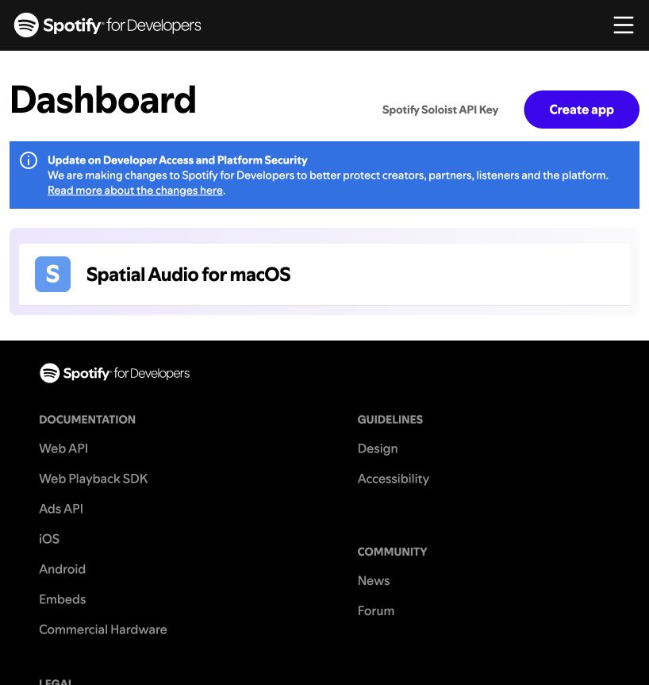
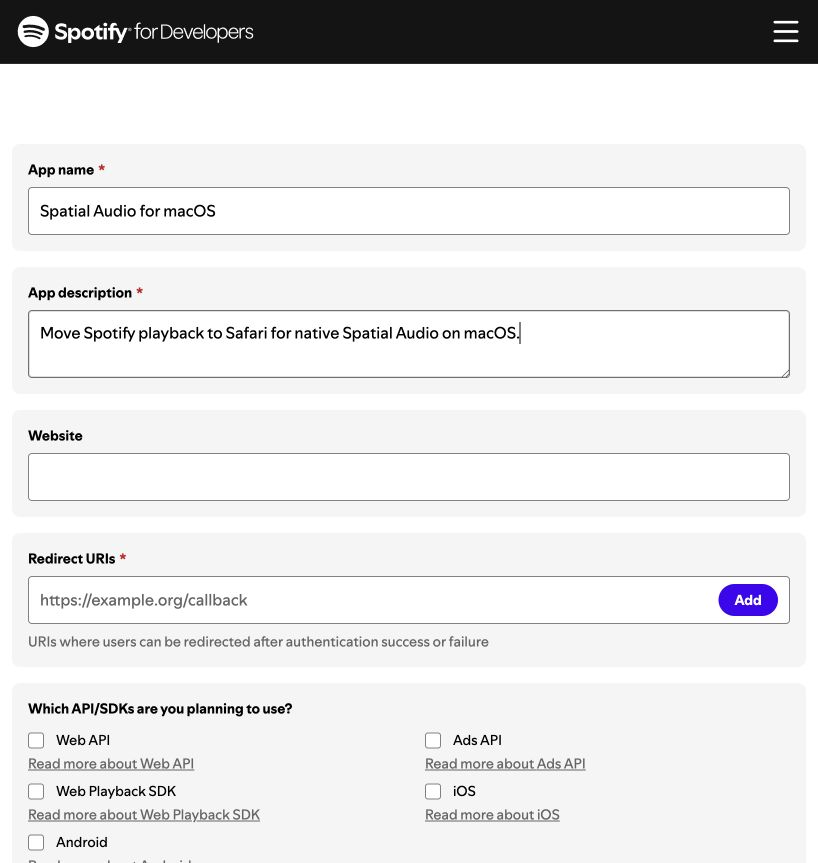
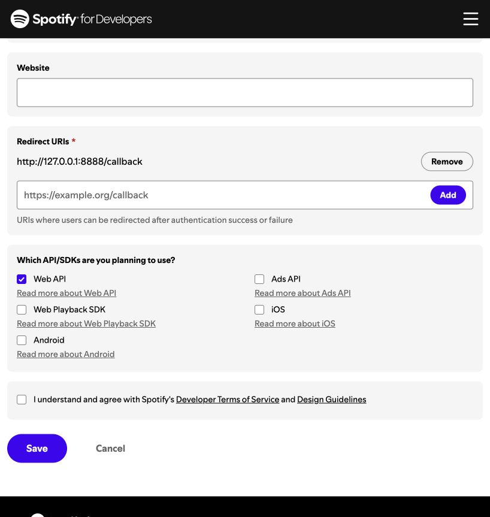
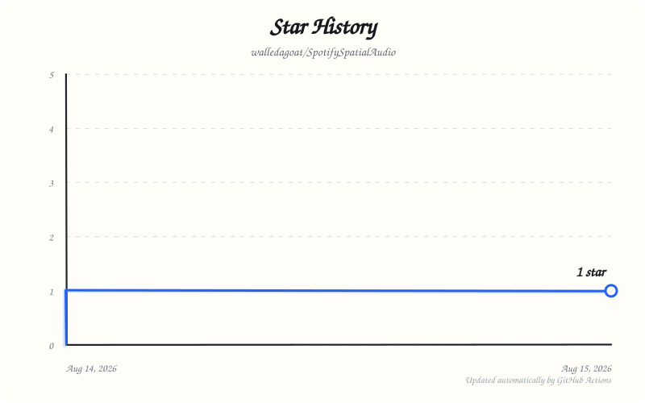

# Spotify Spatial Audio

A modern macOS menu-bar utility that moves Spotify Desktop playback to Spotify Web Player in Safari, allowing macOS and compatible AirPods to provide Spatial Audio. The app does not intercept, decode, or modify Spotify audio.

This repository is a clean-room Swift 6 implementation inspired by the mechanism used by [DervexDev/SpotifySpatialAudio](https://github.com/DervexDev/SpotifySpatialAudio). No compiled helper binaries or Spotify client secret are included.

## Current milestone

- Native SwiftUI `MenuBarExtra` app for macOS 14 and newer.
- Native Liquid Glass dashboard on macOS 26, with material fallbacks for macOS 14–15, live connection/transfer states, guided setup, and quick menu-bar controls.
- Spotify Authorization Code with PKCE (S256), CSRF state validation, and no client secret.
- Fixed `127.0.0.1:8888` loopback callback port for Spotify dashboard compatibility.
- Access and refresh tokens stored as a generic-password item in macOS Keychain.
- Single-flight automatic token refresh with a 60-second expiry leeway.
- Typed, async Spotify Web API client for playback state, devices, transfer, and resume.
- One transparent retry after a `401`, plus bounded `429` retries honoring `Retry-After`.
- Safari-specific Web Player launch and best-effort window minimization without fake keystrokes.
- Device discovery based primarily on newly appeared Spotify Connect IDs, with a session cache and name fallback.
- Playback transfer verification before reporting Spatial Audio as active.
- Unit tests for PKCE, token-store abstractions, Spotify response decoding, and device selection.

Automatic local-playback monitoring is intentionally not part of this foundation yet. For now, start music in Spotify Desktop and choose **Start Spatial Audio** from the menu-bar app.

## Spotify setup

The app opens a visual setup guide the first time it runs. You can reopen it later with the **?** button in the window toolbar or **Setup Guide…** in the menu-bar menu.

1. Open the [Spotify Developer Dashboard](https://developer.spotify.com/dashboard) and choose **Create app**.

   

2. Use a name such as **Spatial Audio for macOS**, add a short description, and leave Website empty. Spotify rejects app names that begin with “Spot”.

   

3. Add this exact redirect URI, choose **Web API**, accept Spotify's terms, and save the app:

   ```text
   http://127.0.0.1:8888/callback
   ```

   This is an HTTP loopback exception: it only accepts requests on your Mac. The app uses this exact URI at runtime. Do not use `localhost`.

   

4. On the app's **Basic Information** page, copy the public **Client ID**. Do not reveal or copy the client secret.
5. Return to Spotify Spatial Audio, paste the Client ID into the guide, and choose **Connect Spotify**.

The Client ID is stored only in macOS user preferences. Authorization uses PKCE, and access/refresh tokens are stored in macOS Keychain.

### Maintainer configuration

For local development, you can optionally provide a fallback Client ID at build time. Create the ignored local configuration:

```sh
cp Config/Spotify.local.xcconfig.example Config/Spotify.local.xcconfig
```

```xcconfig
SPOTIFY_CLIENT_ID = your_client_id
```

The client ID is a public application identifier. Never add a Spotify client secret to this native app.

Fork maintainers can optionally enable the **Buy me a coffee** button by adding their public profile username to the same local configuration:

```xcconfig
BUY_ME_A_COFFEE_USERNAME = your_username
```

The requested scopes are limited to:

- `user-read-playback-state`
- `user-modify-playback-state`

Playback transfer requires Spotify Premium.

## Build

Building requires Xcode 26 or newer so Swift can compile the Liquid Glass APIs. The built app still runs on macOS 14 and newer, using native material fallbacks before macOS 26.

Open `SpotifySpatialAudio.xcodeproj` in Xcode, select your development team if signing is requested, and run the `SpotifySpatialAudio` scheme.

The checked-in Xcode project is generated from `project.yml` with [XcodeGen](https://github.com/yonaskolb/XcodeGen):

```sh
xcodegen generate
```

The same sources can be compiled and tested with Swift Package Manager:

```sh
swift build
swift test
```

## Permissions

The sandboxed app requests only outgoing networking, a local incoming callback connection, and Safari Automation. Safari Automation is used solely to minimize the window containing an `open.spotify.com` tab after transfer. If that permission is denied, playback still transfers and Safari remains visible.

No Accessibility permission or global keyboard event is required.

## Architecture

- `AppState`: main-actor UI state.
- `MainWindowView`: native dashboard, onboarding, status, project, and support actions.
- `SpotifyAuthManager`: PKCE authorization, token exchange, persistence, and refresh.
- `LoopbackCallbackServer`: isolated loopback HTTP callback listener.
- `SpotifyAPIClient`: typed actor-based Spotify Web API access.
- `SafariController`: isolated Safari launch/minimize behavior.
- `SafariDeviceDiscovery`: polling, new-device inference, and session caching.
- `SpatialAudioCoordinator`: ordered transfer and verification flow.

## Known limitations

- Spotify playback transfer is available only to Premium accounts.
- Spotify Connect device visibility can take several seconds.
- Port `8888` must be free during Spotify authorization. Quit the original app's `ssa-core` helper if it is still running.
- Minimizing Safari requires the user to approve Automation access.
- **Stop Spatial Audio** currently stops app coordination; restoring playback to Spotify Desktop is planned for a later milestone.
- Spotify's platform policies apply. This project is independent of and not endorsed by Spotify or Apple.

## License

Apache License 2.0. See `LICENSE` and `NOTICE`.

## Stars

If Spotify Spatial Audio is useful to you, consider starring the repository.

[](https://github.com/walledagoat/SpotifySpatialAudio/stargazers)
